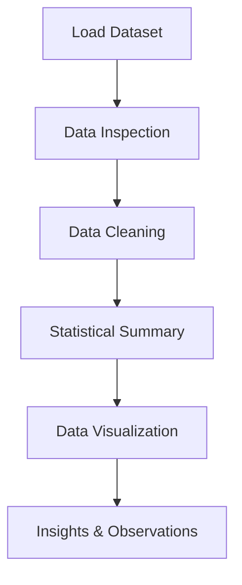

# 📊 Exploratory Data Analysis (EDA) Project


This project focuses on **Exploratory Data Analysis (EDA)** to understand the structure, patterns, and relationships within a dataset.

EDA is a critical step in **Data Science and Machine Learning pipelines**, helping uncover hidden insights and prepare data for further modeling.

---

# 📌 Project Overview

Exploratory Data Analysis (EDA) is the process of analyzing datasets to summarize their main characteristics using **statistical techniques and visualizations**.

In this project, we perform:

* Data inspection
* Data cleaning
* Statistical analysis
* Data visualization
* Pattern discovery

The goal is to **understand the dataset and extract meaningful insights**.

---

# 🧠 Data Analysis Workflow



This workflow represents the **standard EDA pipeline used in data science projects**.

---

# ⚙️ Technologies Used

* **Python**
* **Pandas**
* **NumPy**
* **Matplotlib**
* **Seaborn**
* **Jupyter Notebook**

---

# 📊 Key Analysis Performed

The project includes several important data analysis steps:

### 1️⃣ Data Inspection

* Checking dataset structure
* Viewing dataset shape
* Identifying missing values
* Understanding data types

---

### 2️⃣ Data Cleaning

* Handling missing values
* Removing inconsistencies
* Preparing dataset for analysis

---

### 3️⃣ Statistical Analysis

Using Pandas to compute:

* Mean
* Median
* Standard deviation
* Distribution statistics

---

### 4️⃣ Data Visualization

Various plots are used to explore relationships within the dataset:

* Histogram
* Box Plot
* Correlation Heatmap
* Distribution Plots

Libraries used:

* **Matplotlib**
* **Seaborn**

---

# 📈 Insights Generated

The EDA process helps uncover:

* Feature distributions
* Correlations between variables
* Outliers in the dataset
* Patterns and trends

These insights help guide **feature engineering and model building in future ML tasks**.

---

# 📂 Project Structure

```id="2q6jtw"
EDA-Project
│
├── EDA(TakshPatel).ipynb
├── dataset.csv
├── requirements.txt
├── README.md
```

---

# 🚀 How to Run the Project

### 1️⃣ Clone the Repository

```bash id="1w6a4v"
git clone https://github.com/your-username/eda-project.git
```

---

### 2️⃣ Navigate to the Project Folder

```bash id="6rtv57"
cd eda-project
```

---

### 3️⃣ Install Required Libraries

```bash id="7r7o1s"
pip install -r requirements.txt
```

---

### 4️⃣ Run the Notebook

Open **Jupyter Notebook** and execute all cells.

---

# 🎯 Skills Demonstrated

* Exploratory Data Analysis
* Data Cleaning
* Data Visualization
* Statistical Analysis
* Data Interpretation
* Python Data Science Libraries

---

# 🌍 Importance of EDA

EDA is essential because it helps:

* Understand data patterns
* Detect anomalies
* Improve feature selection
* Prepare data for machine learning models

---

# 👨‍💻 Author

**Taksh Samirkumar Patel**

Computer Science Engineering Student
Interested in **Artificial Intelligence | Machine Learning | Data Science**

🔗 LinkedIn
https://www.linkedin.com/in/taksh-patel-6a6b97325

💻 LeetCode
https://leetcode.com/u/5EWSbJZA6M/

---

⭐ If you found this project useful, consider giving it a **star** on GitHub!
